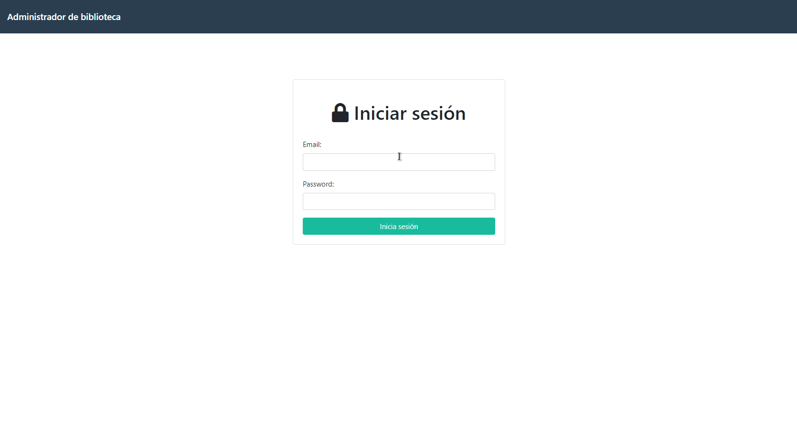

<h1 align="center">
 
BIBLIOSTORE
</h1>

Book manager contains: book list, book loan, book details and student registration

  

[//]: # "Add your gifs/images here:"

  

## Features

[//]: # "Add the features of your project here:"

This app features all the latest tools and practices in web development!

- ⚛️ **React Js** — A JavaScript library for building user interfaces
- 📄 **Firebase** — A cross-platform and open-source document-oriented database
- ♻️ **Redux** — A state handler

## Getting started

**Getting started with the frontend app**

1. Move yourself to the frontend folder: `cd frontend`
2. Copy `.env.example` and change values in the file data of `firebase`
3. Run `yarn start` to start the web application

## License

This project is licensed under the MIT License - see the [LICENSE](https://opensource.org/licenses/MIT) page for details.
